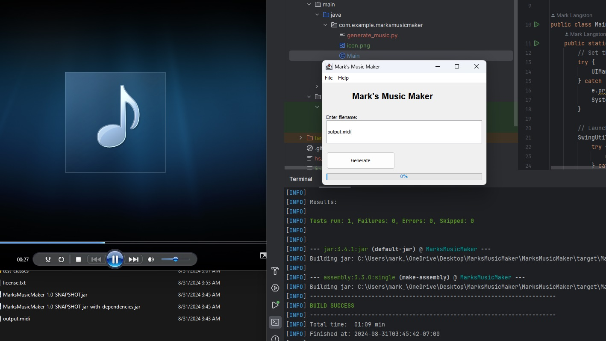

# Mark's Music Maker 🎵



Mark's Music Maker is a Java-based application designed to procedurally generate 1-minute music tracks. It leverages Python and the `music21` library to create MIDI files that can loop seamlessly, featuring orchestral instruments for a rich, engaging sound. The application provides a simple user interface to generate music files easily.

## Demo

[](https://youtu.be/ai5xS7uaAcA)

## Features

- **Procedural Music Generation**: Generates 1-minute orchestral music pieces using Python and `music21`.
- **Randomized Compositions**: Each track is unique, with variations in tempo, melody, harmony, and instrumentation.
- **Seamless Looping**: Designed for projects where tracks need to loop without noticeable breaks.
- **Simple GUI**: Easy-to-use interface built with Java Swing for generating music files with just a click.

## Requirements

### Java Requirements
- Java 22.0.2 or newer
- Maven for building the Java project
- IntelliJ IDEA or any other Java IDE (optional for development)

### Python Requirements
- Python 3.10 (Ensure that this version is used specifically)
- `music21` library for music generation
  - Install via pip:
    ```bash
    pip install music21
    ```

### Installation

1. **Clone the Repository:**

   ```bash
   git clone https://github.com/Mark-Langston/MarksMusicMaker.git

## Licenses

This project includes code from music21, which is licensed under the BSD 3-Clause License. See the LICENSE.txt file for details.
